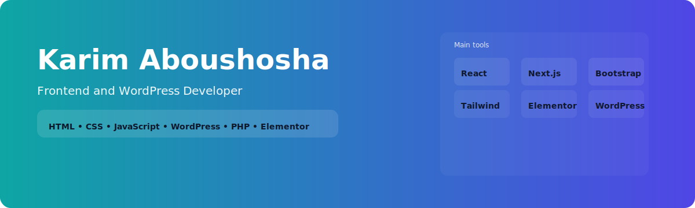

# Hi — I'm **Karim Aboushosha** 👋  
**Frontend & WordPress Developer**  
I build fast, accessible front-ends and polished WordPress sites with attention to UX, performance, and SEO.

---

## 📬 Contact & CV

---

## 🔧 Tech & Languages
Below are **large** badges so your main tools stand out.

  
  
  
  
  
  
  
  
  
  
  
  
  

